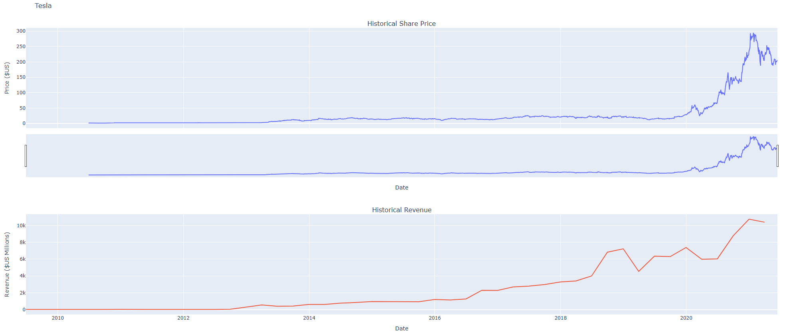
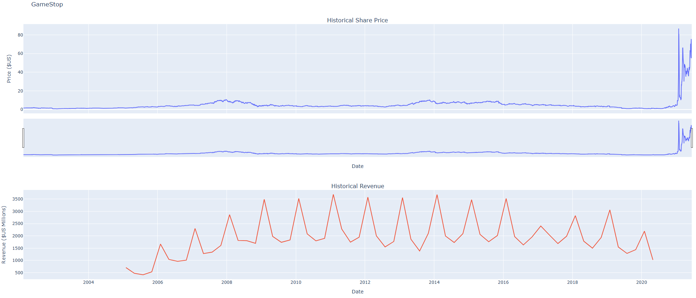

# Stock Price Analysis Dashboard

## Overview
This project focuses on analyzing the relationship between stock prices and company profits, specifically examining Tesla and GameStop. The aim is to build a dashboard that visualizes how profit changes impact stock prices, providing insights for hedge fund strategies, especially in the context of short selling.

## Key Concepts
- **Stock Pricing Factors**: Stock prices depend on outstanding shares, future profits, and overall company performance.
- **Short Selling**: A strategy where investors borrow and sell stocks they believe will decrease in value, repurchasing them later to return to the lender. This can lead to significant losses if the stock price rises unexpectedly.
- **Market Dynamics**: Events like the GameStop phenomenon illustrate how collective investor actions (e.g., via platforms like WallStreetBets) can drastically impact stock prices, sometimes contrary to company fundamentals.

## Objectives
- Extract profit data for Tesla and GameStop.
- Develop a dashboard to compare stock prices against profits.
- Analyze the implications of profit growth on stock price movements, particularly for short sellers.

## Intended Audience
This repository is intended for data scientists, financial analysts, and investors interested in understanding stock price behaviors and developing data-driven investment strategies.

##  Stock Graph:
| Tesla          | GameStop                      |
|----------------------|---------------------------|
|      |   |

## Installation
Instructions on how to set up the project locally.

```bash
# Clone the repository
git clone https://github.com/rodrigoHM/Python-Project-for-Data-Science.git

# Navigate into the directory
cd Python-Project-for-Data-Science

# Install dependencies
pip install -r requirements.txt
